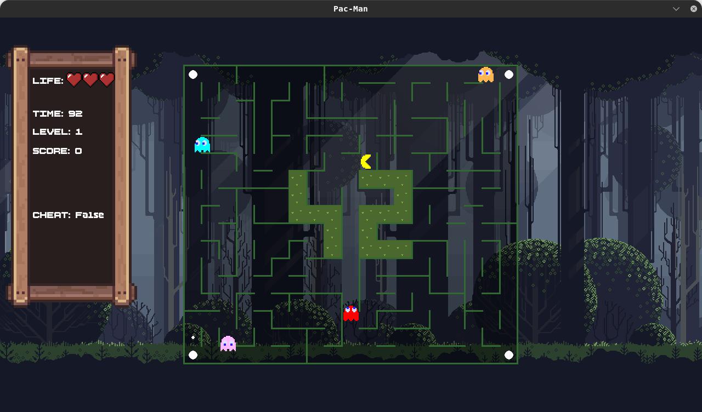

*This project has been created as part of the 42 curriculum by nyramana, finorako.*

# PAC-MAN

<!--toc:start-->
- [PAC-MAN](#pac-man)
  - [Description](#description)
  - [Instructions](#instructions)
  - [Ressources](#ressources)
  - [Configuration](#configuration)
  - [Highscore](#highscore)
  - [Maze Generation](#maze-generation)
  - [Implementation](#implementation)
  - [General software Architecture](#general-software-architecture)
    - [GUI](#gui)
    - [MazeGenerator module](#mazegenerator-module)
    - [Entity](#entity)
    - [Rendering](#rendering)
  - [Project Management](#project-management)
<!--toc:end-->

## Description

Pac-Man is a 42 project that consist of, like his name, recreating the legendary game **PacMan**. To do that, we used Python and the famous pygame library to build it from the ground up while only using some low level function with the graphics.

### Goal

The goal of this project is to create a full game while using Object-Oriented Programming, a simple graphical library an da modular, reusable architecture.

It must support all the feature the game has like setting using the config file, high score implementation, win/lose logics, polished graphical UI and more.

### Brief overview



The game is pretty simple, with all the main logic of the original game but with the cheat mode and some custom assets. **See the instructions in the game**

## Instructions

To play, you have the following choice bellow:

### Binary run

- Using the binary in the `itch.io` website and just run it with the **config** file (will be explained better in [this section](#configuration))

### Manual

A makefile if present in the repository.

Commands:

- Install the dependencies

```bash
make # Or make install
```

- Run the program with the default config file being the `config.json` in the repository.

```bash
make run
```

- Debugging the program.

```bash
make debug
```

- Clean all the artefacts in the repository.

```bash
make clean
```

- Clean the artefacts and de venv file in the repository.

```bash
make fclean
```

- Check the code qualities of the project (with the docstring).

```bash
make lint # or make lint-strict
```

- Rebuild the vent for the project.

```bash
make re
```

- Build the binary for the game based on the OS. It will generate a *tar.gz* file and you can just extract it and play it anywhere. But the binary will also be in the `dist` file.

```bash
make build_game
```

- Run the built game in the dist file.

```bash
make run_built_game
```

- You can also run it via the command line: just run: `uv run python -m pacman.py <config.json>` it will install automatically all the packages needed to lunch the program.

## Resources

Peer to peer was the main resources we used to complete this project. But stack overflow and slack was also part of it.

**Others:**

- [Line drawing algorithm](https://en.wikipedia.org/wiki/Line_drawing_algorithm)
- [pyinstaller](https://pyinstaller.org/en/stable/)

### AI Usage

AI was not used very much with this project. The only time AI was used was to check the readme file and the mispelled words.

## Configuration

The configuration is should be in a json format that can handle python commentary (when the line starts with # it is considered as a commentary).

Bellow is an example:

```
{
 "pacgum_number": 32,
 "points_per_pacgum": 10,
 "points_per_super_pacgum": 25,
 # this is a commentary
 "points_per_ghost": 100,
 "level_max_time": 120,
 "life": 3,
 "seed": 42,
 "level_count": 10
}
```

Default value:


| key | default | limits |
| --------------- | --------------- | --------------- |
| pacgum_number | 32 | 0 to 343 |
| points_per_pacgum | 10 | 1 to 1000 |
| points_per_super_pacgum | 25 | 1 to 1000 |
| points_per_ghost | 100 | 1 to 1000 |
| level_max_time | 120 | 30 to 1000 |
| Life | 3 | 1 to 10 |
| seed | 42 | Any number |
| level_count | 10 | Minimum 10 |


## Highscore

For the high score, we decided to store it in a simple json file as it's easer to manipulate without the need of other dependencies to manipulate it.

Bellow is an example of how we store it:

```
[
    {
        "player_name": "this",
        "player_score": 1405,
        "player_time": 120
    },
    {
        "player_name": "sdfesfesd",
        "player_score": 104,
        "player_time": 90
    },
 ...
]
```

The highscore works by getting all the player with their score, It sort them and the player with the most score is stored at the first index of the array. We used a pydantic class to store them and only take the top 10 if there are many player.

## Maze Generation

Provided with the subject of this project, there was a package that we must use a `MazeGenerator` it can generate a maze with 42 logo in it. And so we used it to generate a maze for us and using it's API we communicate with it to render that maze onto the screen.

## Implementation

- Our implementation is quite simple, every important component of the project is a class so everything is modular, We also used some state machine for the big part which is the screen. Other entity could have some state machine too but we decided to not use them since the logic is quite easy.

- For the ghost we went with a simple yet effective way so that it doesn't include a lot of change or other implementation. A ghost has three behavior; the first one is:

- - `find direciton`: in this state it just randomly find direction each turn.
- - `chase player`: in this state as long as the player is in it's line of vision it will follow the player based on a simple bfs algorithm to find the shortest path.
- - `escape player`: in this state as long as it can be eaten it will randomly choose a direction that doesn't lead to the player.

The best part of the ghost implementation is that we made it so that every time the player complete a level we increase the line of sight of each ghost so that we don't need to tune the algorithm as it depends on the line of sight of the ghost.

## General software Architecture

### GUI

We where limited to only using functions that has an equivalence inside the mlx library, so that's why
by using the pygame-ce library we limited the use of the APIs to only the bare minimum.

For the GUI we used the following APIs and their equivalence in the mlx library.

| PYGAME | MLX |
| ------- | ---- |
| pygame.Surface | mlx.mlx_new_image |
| pygame.event | mlx.mlx_hook |
| pygame.Surface.set_at | mlx.mlx_put_pixel |
| pygame.display.set_mode | mlx.mlx_new_window |
| pygame.display.set_caption | a parameter of mlx.mlx_new_window |
| pygame.mouse.get_pos | mlx.mlx_mouse_hook |
| pygame.image.load | mlx.mlx_png_file_to_image |
| pygame.keys.get_just_pressed | mlx.mlx_key_hook |
| pygame.keys.get_pressed | mlx.mlx_key_hook |
| pygame.font.render | mlx.mlx_string_put |

### MazeGenerator module

How did we use the `MazeGenerator` module

| API | explanation |
| ---- | ----------- |
| generate | This method generate a maze for us, it return a list of list integer that represent the wall for the current cell |
| _find_short_path | As we where allowed to use this module as we like without changing the content, we just used this method to generate the shortest path for the ghost for searching the player |

### Entity

The entity class, representing a player is used as the base class for all the players/ghost

| Class | Description |
| :--- | :--- |
| Entity | base class for players/ghost |
| Player | player representation |
| Ghost | Ghost representation |

### Rendering

The naming here is a bit confusing but in a sense, this is the class that combine all our functionalities
it contain all the necessary functions so that our project work perfectly.

| Rendering API | Description |
| :---- | :----: |
| run | Running the game simulation |
| update | updating what is on the screen |
| render | Render onto the screen what happen behind |
| get_event | getting event from the current screen, such as changing player direction for exampl |
| load_background | loading the background |

## Project Management

To make it so that our workflow work in the correct path and avoid conflict as possible, we assign each a role,
`nyramana` for the rendering part and `finorako` for the backend stuff and by doing it that way we avoided as
much as possible conflict and conducted a better workflow. It is also worth notice that when doing this project,
when revewing the PR we can make some descision on how to change or twinking the code to be merged with that
we made it so that the we understand each the codes of the others without much effort.

Here is a link to our project management other than the provided inside `PROJECT Management` directory: [project management](https://github.com/users/finorak/projects/2/views/1)
